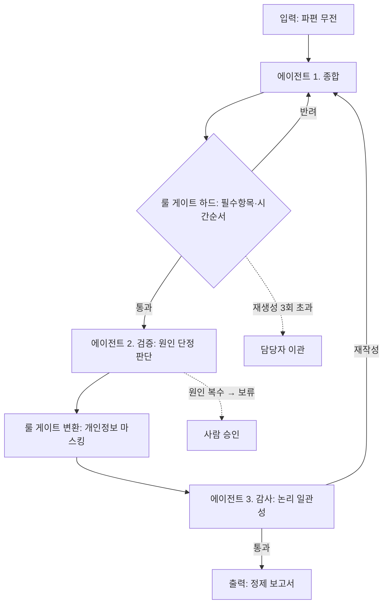
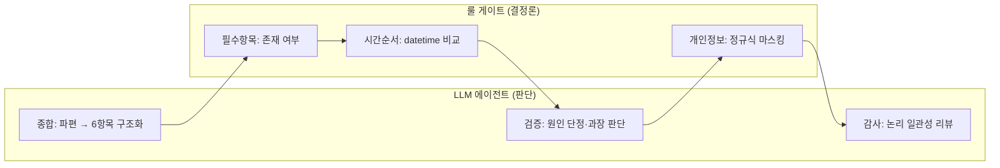

# SITREP Harness — 소방 상황보고 멀티에이전트 하네스

> 정신없는 현장에서 쏟아지는 **파편 무전**을, 세 에이전트의 협업과 검증 게이트를 거쳐 **정제된 상황보고서**로 바꾸는 AI 하네스.
> 핵심 설계 판단: **판단이 필요한 검증은 LLM 에이전트에게, 결정론으로 딱 떨어지는 검증은 룰 게이트에게.**

참고 하네스: [`cdsassj00/miniharness`](https://github.com/cdsassj00/miniharness) (cdsa-harness)

---

## 1. 주제 — 무엇을 하는 하네스인가

소방 상황실에서 사고 초기의 정보는 **무전으로 파편처럼** 들어온다. 시각이 뒤섞이고, 원인이 확정 전에 입에 오르내리고, 신고자 개인정보가 섞이고, 필수 항목이 빠진 채로 흐른다. 이걸 사람이 매번 정리해 상급기관 보고 양식으로 만든다.

`SITREP Harness` 는 이 과정을 **세 LLM 에이전트 + 결정론적 룰 게이트**의 협업 파이프라인으로 자동화한다.

## 2. 구성 목적

harness 의 본체는 **에이전트 루프**다 — 입력을 받아 컨텍스트를 구성하고, 모델을 호출하고, 그 판단에 따라 도구를 실행하고, 결과를 되먹여 반복하는 골격. 참고한 `cdsa-harness` 도 이 루프(`loop.js`)를 심장으로 두고, 그 위에 **제약**(sandbox=경로 제약, `[y/N]` 승인=행동 제약, 도구 스키마=능력 제약)을 얹어 루프가 선을 넘지 않게 한다.

이 프로젝트는 그 골격을 소방 상황보고 업무로 가져오되, **검증(제약)에 특히 무게를 실었다.** 상황보고는 틀리면 기록으로 남는 문서라, "모델이 잘 써주기를 기대"하는 것보다 "모델 출력이 반드시 통과해야 하는 검증"을 세우는 쪽이 이 업무에 맞기 때문이다. 루프가 뼈대이고, 그 위의 검증 게이트·에이전트가 이 하네스가 특히 공들인 부분이다.

### 이 하네스만의 설계 판단: 에이전트 vs 룰 게이트

멀티에이전트라고 모든 검증을 LLM 에 맡기지 않는다. **참/거짓이 룰로 딱 떨어지는 검증**(필수항목 존재, 시각 비교, 개인정보 정규식)에 LLM 을 부르는 건 낭비이자 불안정이다. 반대로 **뉘앙스 판단이 필요한 검증**(원인을 단정했는가, 보고서가 논리적으로 말이 되는가)은 룰로 못 잡는다.

> 어디까지가 룰이고 어디부터가 에이전트인지 나눈 것 — 이것이 이 하네스가 특히 공들인 설계 판단이다.

## 3. 전체 구조

### 3.1 파이프라인



### 3.2 에이전트 책임 분리



| 파일 | 역할 |
|---|---|
| `harness.py` | 오케스트레이터 — 에이전트·게이트 파이프라인, 재생성 상한, 로그 |
| `agents.py` | **LLM 에이전트 3종 (종합·검증·감사)** — 판단이 필요한 검증 |
| `gates.py` | **결정론적 룰 게이트 3종** — 판단이 필요 없는 검증 |
| `schema.py` | 상황보고 스키마 — 필수 6항목 + 시간 순서 |
| `samples/` | 파편 무전 샘플 (가상) |

## 4. 검증 설계

| 단계 | 담당 | 종류 | 동작 |
|---|---|---|---|
| 종합 | 에이전트 ① | LLM | 파편 무전 → 6항목 구조화 |
| 필수항목 | 룰 게이트 | HARD | 6항목 중 빈 값 있으면 반려 → 재생성 |
| 시간순서 | 룰 게이트 | HARD | 시각 역전이면 반려 → 재생성 |
| 원인 단정 | 에이전트 ② | LLM | 확정형이면 교정, 원인 복수면 사람 승인 보류 |
| 개인정보 | 룰 게이트 | TRANSFORM | 성명·연락처 자동 마스킹 |
| 논리 감사 | 에이전트 ③ | LLM | 논리 모순 있으면 재작성 요구 |

여기에 harness 제약 하나 더 — **재생성 상한(3회)**. 하드 게이트나 감사가 계속 반려하면 무한루프이므로, 상한 초과 시 "자동 실패 → 담당자 이관"으로 빠진다.

### 검증 에이전트가 특별한 이유

**현장에서는 원인을 알 수 없다.** 원인은 발화지점 분석·감식 후에야 나온다. 초기 대응 중 "누전으로 발생"이라고 단정하면, 조사에서 뒤집힐 때 그 단정이 기록으로 남는다.

룰로는 "누전으로 발생"은 잡아도 "화재는 전기적 문제에서 비롯된 것으로 판단됨" 같은 **우회 단정**은 못 잡는다. 그래서 원인 판단은 에이전트가 맡는다 — 유보어 없는 확정형이면 교정하고, 원인이 둘 이상 얽히면 기계 교정 대신 **사람 승인으로 보류**한다. 이 판단 기준에 현직 소방관의 도메인 지식이 들어간다.

## 5. 사용 방법

```bash
# 의존성 없음. Python 3.9+ 만 있으면 됨.
python harness.py samples/radio_01.txt          # 에이전트·게이트 로그와 함께
python harness.py samples/radio_01.txt --quiet   # 최종 보고서만

# 실제 LLM 에이전트를 쓰려면(선택):
export OPENROUTER_API_KEY=sk-...
python harness.py samples/radio_01.txt
```

키가 없으면 세 에이전트가 자동으로 **mock 모드**로 돈다 — 각 에이전트가 근거를 대며 판단하는 형태라, 키 없이도 멀티에이전트 협업 흐름 전체를 눈으로 확인할 수 있다.

## 6. 실행 예시 (실제 출력)

### 예시 A — 필수항목 반려 → 재생성 → 세 에이전트 협업 → 출력

입력 (파편 무전, 발췌):

```
14:32 상황실. ○○구 ○○동 △△상가 화재신고 접수. 신고자 김철수, 연락처 010-1234-5678.
14:41 현장도착. 2층 전기실 쪽에서 연기. 누전인 것 같다.
15:03 초진. 한 명 연기 마셔서 나온 사람 있음.
```

실행 로그:

```
* 시도 1/3
[에이전트 1.종합] 파편 무전 -> 6항목 구조화
  -> 6항목 초안 생성 완료
[룰 게이트/하드] 결정론 검증
  X 필수항목   누락: 인명피해
  X 하드 게이트 반려 -> 재생성 (남은 2)

* 시도 2/3
[에이전트 1.종합] 파편 무전 -> 6항목 구조화
[룰 게이트/하드] 결정론 검증
  O 필수항목   6항목 모두 존재
  O 시간순서   검사 4개 시각, 순서 정상
[에이전트 2.검증] 원인 단정/과장 판단
  판단: fix - '누전' 확정형 서술 — 유보어 삽입 필요
  -> 유보어 삽입 교정 반영
[룰 게이트/변환] 개인정보 마스킹
  ~ 개인정보   마스킹: 성명, 연락처
[에이전트 3.감사] 논리 일관성 리뷰
  . 인명피해·조치사항·동원현황 간 명백한 논리 모순 없음
  O 감사 통과
[출력] 전 단계 통과 -> 보고서 확정
```

출력 (정제된 상황보고서):

```
[ 상황보고 ]

o 발생일시: 2026-07-15T14:32
o 장소: 서울 ○○구 ○○동 △△상가 2층
o 사고개요: 2층 전기실 인근에서 발화, 누전(으)로 추정. 상층 연기 확산 중.
            신고자 김○○(010-****-****) 진술상 점포 내 미확인.
o 인명피해: 경상 1명(대피 중 연기 흡입), 사망자 없음(수색 계속)
o 동원현황: 펌프 3, 물탱크 1, 구급 2 / 인원 21명
o 조치사항: 내부 진입 검색, 상층 대피 유도, 전기 차단 요청.
```

`누전인 것 같다` → 검증 에이전트가 `누전(으)로 추정`으로 교정, `김철수(010-1234-5678)` → 룰 게이트가 `김○○(010-****-****)`로 마스킹, 1차에 빠졌던 인명피해가 재생성으로 채워진 것을 확인할 수 있다.

### 예시 B — 시간순서 반려 + 검증 에이전트 사람 승인 보류

`python harness.py samples/radio_02.txt`

```
* 시도 1/3
[룰 게이트/하드] 결정론 검증
  O 필수항목   6항목 모두 존재
  X 시간순서   모순: 완진(14:50) < 초진(15:03)
  X 하드 게이트 반려 -> 재생성 (남은 2)

* 시도 2/3
[룰 게이트/하드] 결정론 검증
  O 필수항목   6항목 모두 존재
  O 시간순서   검사 5개 시각, 순서 정상
[에이전트 2.검증] 원인 단정/과장 판단
  판단: hold - 원인 복수 언급(누전, 방화) — 기계 교정 시 의미 훼손 위험, 담당자 확인 필요
  -> 사람 승인 보류 표시
[에이전트 3.감사] 논리 일관성 리뷰
  O 감사 통과
! 사람 승인 대기 항목 있음 - 담당자 확인 후 확정.
```

완진이 초진보다 빠른 시간 모순을 룰 게이트가 잡아 재생성하고, 원인이 둘("누전 또는 방화") 얽힌 경우는 검증 에이전트가 자동 교정 대신 사람 승인으로 넘기는 것을 볼 수 있다.

---

## 설계 노트

- **에이전트와 룰 게이트를 별도 파일로 분리**한 것은 의도적이다. `agents.py`(판단)와 `gates.py`(결정론)를 열면, 무엇을 LLM 에 맡기고 무엇을 룰로 처리했는지가 바로 드러난다.
- **하드 게이트를 종합 직후에, 감사를 맨 뒤에** 둔다. 반려될 보고서에 검증·변환 에이전트를 낭비하지 않기 위해서다.
- 모든 샘플 무전은 **가상 훈련 상황**이며 실제 사건이 아니다.
