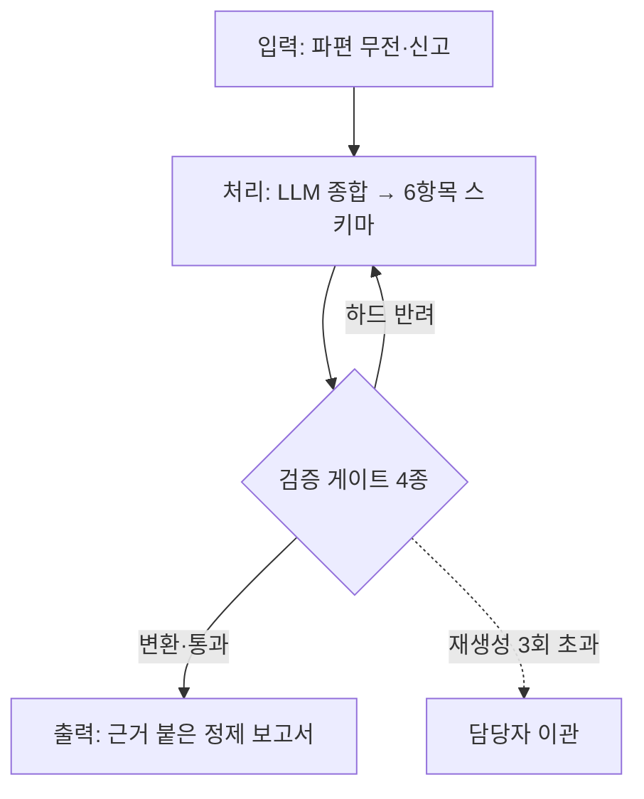

# SITREP Harness — 소방 상황보고 검증 하네스

> 정신없는 현장에서 쏟아지는 **파편 무전**을, 검증 게이트를 통과한 **정제된 상황보고서**로 바꾸는 AI 하네스.
> LLM 을 똑똑하게 만드는 대신, **제약으로 가둬서 예측 가능하게** 만든다.

참고 하네스: [`cdsassj00/miniharness`](https://github.com/cdsassj00/miniharness) (cdsa-harness)

---

## 1. 주제 — 무엇을 하는 하네스인가

상황실에서 사고 초기의 정보는 **무전으로 파편처럼** 들어온다. 시각이 뒤섞이고, 원인이 확정 전에 입에 오르내리고, 신고자 개인정보가 섞이고, 필수 항목이 빠진 채로 흐른다. 이걸 사람이 매번 정리해 상급기관 보고 양식으로 만든다.

`SITREP Harness` 는 이 과정을 **입력 → 처리 → 검증 → 출력** 파이프라인으로 자동화한다. 핵심은 "LLM 이 잘 써주기를 기대"하는 게 아니라, **LLM 출력이 반드시 통과해야 하는 제약(검증 게이트)** 을 앞에 세우는 것이다.

## 2. 구성 목적 — harness = 제약 설계

`harness` 는 마구(馬具)다. 힘세지만 제멋대로인 말(LLM)에 씌워 **정해진 길로만 가게** 하는 장치. 그래서 이 프로젝트의 90%는 모델을 똑똑하게 만드는 게 아니라 **모델이 낼 수 있는 출력을 좁히는 제약**에 있다.

참고한 `cdsa-harness` 도 같은 철학이다 — sandbox(경로 제약), `[y/N]` 승인(행동 제약), 도구 스키마(능력 제약). 이 하네스는 그 승인 게이트를 **소방 업무에 맞는 자동 검증 게이트**로 확장한다.

## 3. 전체 구조



| 파일 | 역할 |
|---|---|
| `harness.py` | 오케스트레이터 — 입력→처리→검증→출력, 재생성 상한, 로그 |
| `gates.py` | **검증 게이트 4종 (제약의 심장)** |
| `schema.py` | 상황보고 스키마 — 필수 6항목 + 시간 순서 |
| `llm.py` | LLM 종합 (OpenRouter, 키 없으면 mock) |
| `samples/` | 파편 무전 샘플 (가상) |

## 4. 검증 게이트 설계

제약마다 **처리 방식**을 다르게 배정한 것이 이 하네스의 핵심 설계다. 전부 반려하면 무한루프, 전부 승인이면 자동화가 아니다.

| 게이트 | 종류 | 동작 | 판정 |
|---|---|---|---|
| ① 필수항목 6종 | **HARD** | 하나라도 비면 반려 → 재생성 | 결정론적 (존재 여부) |
| ① 시간 순서 | **HARD** | 뒤 단계가 앞보다 빠르면 반려 → 재생성 | 결정론적 (`datetime` 비교) |
| ② 원인 유보어 | **TRANSFORM** | 확정형이면 "추정" 자동 삽입 | 룰 (어휘+유보어) |
| ③ 개인정보·양식 | **TRANSFORM** | 성명·연락처 마스킹, 개조식 정규화 | 룰 |

여기에 harness 제약 하나 더 — **재생성 상한(3회)**. 하드 게이트가 계속 반려하면 무한루프이므로, 상한 초과 시 "자동 실패 → 담당자 이관"으로 빠진다.

### 원인 게이트가 특별한 이유

**현장에서는 원인을 알 수 없다.** 원인은 발화지점 분석·감식 등 심층 조사 후에야 나온다. 정신없는 초기 대응 중에 "누전으로 발생"이라고 단정하면, 조사에서 뒤집힐 때 그 단정이 기록으로 남는다.

그래서 이 게이트는 원인 어휘를 **막지 않는다** — 현장 판단("누전으로 보인다")은 정당하니까. 다만 유보어 없이 확정형으로 나가면 "추정"을 자동으로 붙인다. 단, 원인이 둘 이상 얽히면("누전 또는 방화") 기계적 삽입이 위험하므로 **소프트 폴백**(사람 승인)으로 넘긴다. 이 판단 기준이 현직 소방관의 도메인 지식이 들어간 지점이다.

## 5. 사용 방법

```bash
# 의존성 없음. Python 3.9+ 만 있으면 됨.
python harness.py samples/radio_01.txt          # 게이트 로그와 함께 실행
python harness.py samples/radio_01.txt --quiet   # 최종 보고서만

# 실제 LLM 을 쓰려면(선택):
export OPENROUTER_API_KEY=sk-...
python harness.py samples/radio_01.txt
```

키가 없으면 자동으로 **mock 모드**로 돈다 — 키 없이도 게이트 흐름 전체를 눈으로 확인할 수 있다.

## 6. 실행 예시

### 예시 A — 필수항목 반려 → 재생성 → 변환 → 출력

입력 (파편 무전, 발췌):

```
14:32 상황실. ○○구 ○○동 △△상가 화재신고 접수. 신고자 김철수, 연락처 010-1234-5678. 2층에서 연기 난다고.
14:34 펌프1 물탱크1 출동.
14:41 선착대 현장도착. 2층 전기실 쪽에서 연기 올라오는 중. 누전인 것 같다.
15:03 초진. 대피 유도 중. 한 명 연기 마셔서 나온 사람 있음.
```

검증 로그 (실제 출력):

```
[처리] LLM 종합 (시도 1/3)
[검증] 게이트 통과 검사
  ✗ 필수항목   누락: 인명피해
  ✗ 하드 게이트 반려 → 재생성 (남은 시도 2)

[처리] LLM 종합 (시도 2/3)
[검증] 게이트 통과 검사
  ✓ 필수항목   6항목 모두 존재
  ✓ 시간순서   검사 4개 시각, 순서 정상
  ✎ 원인유보   '누전' 확정형 → 유보어 삽입
  ✎ 개인정보   마스킹: 성명, 연락처
[출력] 모든 하드 게이트 통과 → 보고서 확정
```

출력 (정제된 상황보고서):

```
【 상황보고 】

ㅇ 발생일시: 2026-07-15T14:32
ㅇ 장소: 서울 ○○구 ○○동 △△상가 2층
ㅇ 사고개요: 2층 전기실 인근에서 발화, 누전(으)로 추정. 상층 연기 확산 중.
             신고자 김○○(010-****-****) 진술상 점포 내 미확인.
ㅇ 인명피해: 경상 1명(대피 중 연기 흡입), 사망자 없음(수색 계속)
ㅇ 동원현황: 펌프 3, 물탱크 1, 구급 2 / 인원 21명
ㅇ 조치사항: 내부 진입 검색, 상층 대피 유도, 전기 차단 요청.
```

파편 무전의 `누전인 것 같다` → `누전(으)로 추정`, `김철수(010-1234-5678)` → `김○○(010-****-****)`, 그리고 1차에 빠졌던 인명피해가 재생성으로 채워진 것을 확인할 수 있다.

### 예시 B — 시간순서 반려 + 원인 다중 소프트 폴백

`python harness.py samples/radio_02.txt`

```
[처리] LLM 종합 (시도 1/3)
  ✓ 필수항목   6항목 모두 존재
  ✗ 시간순서   모순: 완진(14:50) < 초진(15:03)
  ✗ 하드 게이트 반려 → 재생성 (남은 시도 2)

[처리] LLM 종합 (시도 2/3)
  ✓ 필수항목   6항목 모두 존재
  ✓ 시간순서   검사 5개 시각, 순서 정상
  ⚠ 원인유보   원인 어휘 다중(누전, 방화) — 문장 확인 후 승인 필요
  ✓ 개인정보   마스킹 대상 없음
  ⚠ 사람 승인 대기 항목 있음 — 담당자 확인 후 확정.
```

완진이 초진보다 빠른 시간 모순을 하드 게이트가 잡아 재생성하고, 원인이 둘("누전 또는 방화") 얽힌 경우는 자동 변환 대신 사람 승인으로 폴백하는 것을 볼 수 있다.

---

## 설계 노트

- **게이트를 별도 파일(`gates.py`)로 분리**한 것은 의도적이다. 게이트(제약)가 하네스의 본체이므로, 코드를 열면 제일 먼저 검증 로직이 보여야 한다.
- **하드 게이트를 먼저, 변환 게이트를 나중에** 실행한다. 반려될 보고서에 변환을 낭비하지 않기 위해서다.
- 모든 샘플 무전은 **가상 훈련 상황**이며 실제 사건이 아니다.
